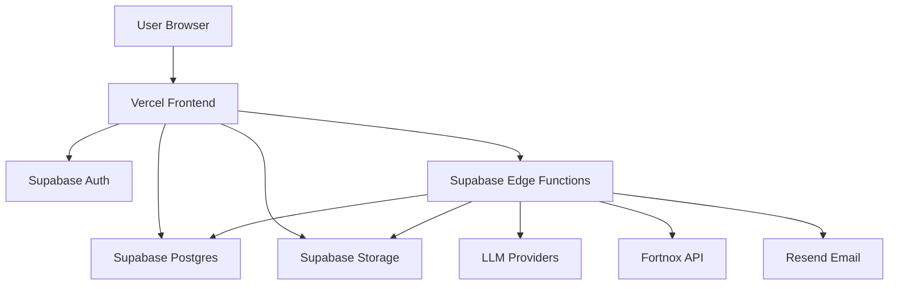

## Executive summary
Veridat is a Vercel-hosted web app that relies on Supabase Auth/DB/Storage and Edge Functions for AI chat, VAT analysis, and Fortnox integration. The highest-risk themes are tenant isolation and document confidentiality, especially around public storage buckets and token handling. The most urgent risks are public access to uploaded documents and Fortnox token mix-ups across users, both of which can lead to cross-tenant data exposure or incorrect accounting actions.

## Scope and assumptions
In-scope paths: `apps/web/src/`, `apps/web/app/`, `supabase/functions/`, `supabase/services/`, `supabase/migrations/`.
Out of scope: `python-api/` and Railway deployment (not used), `dist/` build artifacts, `tests/`.
Assumptions used for ranking:
- The app is publicly reachable via a Vercel URL and intended for multi-tenant SaaS usage.
- Supabase Auth is the primary authn/authz boundary for browser and Edge Function calls.
- Uploaded PDF/Excel documents must be private and accessible only to their owning user.
- Fortnox integration is enabled for multiple users (not a single shared tenant).
Open questions that would materially change ranking:
- Are any storage buckets intentionally public for non-sensitive content?
- Do you run any server-side proxy in front of Supabase or are all calls client-to-Supabase?

## System model
### Primary components
- Browser-based frontend served by Vercel with Supabase client usage (apps/web/src/lib/supabase.ts, apps/web/src/services/ChatService.ts).
- Supabase Edge Functions for AI chat, Fortnox actions, file analysis, memory, billing admin, and email consent (supabase/functions/*).
- Supabase Postgres with RLS policies for core tables and audit logs (supabase/migrations/*).
- Supabase Storage buckets for uploaded documents (supabase/migrations/20241204_create_chat_files_bucket.sql, supabase/migrations/20241125000001_create_files_table.sql).
- External integrations: Fortnox OAuth + API, Gemini/OpenAI providers, Resend email API (supabase/functions/fortnox-oauth/index.ts, supabase/services/FortnoxService.ts, supabase/services/GeminiService.ts, supabase/functions/send-consent-email/index.ts).

### Data flows and trust boundaries
- User browser → Vercel frontend (HTTPS). Data: credentials, chat messages, files. Security: TLS; no server-side auth on static assets. Validation: client-side size/type checks for files (apps/web/src/services/FileService.ts).
- Browser → Supabase Auth (HTTPS). Data: login/magic-link tokens. Security: Supabase Auth + JWTs (apps/web/src/lib/supabase.ts, apps/web/src/services/ChatService.ts).
- Browser → Supabase Postgres via supabase-js (HTTPS). Data: conversations/messages. Security: RLS by `auth.uid()` (supabase/migrations/20251201120000_optimize_rls_policies.sql, supabase/migrations/20251127000001_create_conversations.sql).
- Browser → Supabase Storage (HTTPS). Data: PDFs/Excel files. Security: bucket policies; currently public buckets exist (supabase/migrations/20241204_create_chat_files_bucket.sql, supabase/migrations/20241125000001_create_files_table.sql). Validation: file size/type checks in client (apps/web/src/services/FileService.ts).
- Browser → Edge Functions (HTTPS). Data: prompts, VAT context, Fortnox actions. Security: Authorization bearer required on key endpoints (supabase/functions/gemini-chat/index.ts, supabase/functions/fortnox/index.ts, supabase/functions/memory-service/index.ts, supabase/functions/generate-sie/index.ts).
- Edge Functions → Supabase Postgres (service role). Data: conversations, messages, audit logs, tokens. Security: service role bypasses RLS; relies on function-level auth checks (supabase/functions/gemini-chat/index.ts, supabase/functions/fortnox/index.ts, supabase/migrations/20260119000001_create_audit_trail.sql).
- Edge Functions → External APIs (HTTPS). Data: prompts to LLMs, Fortnox accounting operations, consent emails. Security: API keys in env vars; no PII redaction indicated in code (supabase/services/GeminiService.ts, supabase/services/FortnoxService.ts, supabase/functions/send-consent-email/index.ts).

#### Diagram

## Assets and security objectives
| Asset | Why it matters | Security objective (C/I/A) |
| --- | --- | --- |
| Uploaded PDFs/Excel files | Contains financial/PII data | C, I |
| Chat messages and VAT reports | Financial reasoning and records | C, I |
| Fortnox access/refresh tokens | Grants access to accounting system | C, I |
| Supabase Auth tokens | Gate access to user data | C |
| Audit logs and AI decisions | Compliance and forensic trail | I, A |
| Supabase service role key | Full DB access | C, I |
| User/company profile data | Identifying information | C |

## Attacker model
### Capabilities
- Remote, unauthenticated internet attacker can access public Vercel frontend and any public buckets.
- Authenticated but malicious user can call Supabase RPCs and Edge Functions with their own JWT.
- Attacker can upload crafted PDFs/Excel files and craft OAuth state parameters.
- Attacker can exploit misconfigurations in storage policies or CORS.

### Non-capabilities
- No direct access to Supabase service role key or backend env vars.
- No network-level MITM against TLS.
- Railway/Python API is out of scope and not reachable.

## Entry points and attack surfaces
| Surface | How reached | Trust boundary | Notes | Evidence (repo path / symbol) |
| --- | --- | --- | --- | --- |
| `functions/v1/gemini-chat` | Browser fetch | Browser → Edge Function | Requires Authorization; uses service role for DB | supabase/functions/gemini-chat/index.ts (`Deno.serve`, auth check) |
| `functions/v1/analyze-excel-ai` | Browser fetch | Browser → Edge Function | Parses Excel with `xlsx` | supabase/functions/analyze-excel-ai/index.ts |
| `functions/v1/fortnox` | Browser fetch | Browser → Edge Function → Fortnox | Requires Authorization; uses Fortnox tokens | supabase/functions/fortnox/index.ts |
| `functions/v1/fortnox-oauth` | Fortnox redirect | Fortnox → Edge Function | OAuth callback trusts `state` JSON | supabase/functions/fortnox-oauth/index.ts (`handleOAuthCallback`) |
| `functions/v1/memory-service` | Browser fetch | Browser → Edge Function | Uses anon key + user JWT | supabase/functions/memory-service/index.ts |
| `functions/v1/memory-generator` | Browser fetch | Browser → Edge Function | Generates memories via LLM | supabase/functions/memory-generator/index.ts |
| `functions/v1/send-consent-email` | Browser invoke | Browser → Edge Function → Resend | Sends email via Resend | supabase/functions/send-consent-email/index.ts |
| Supabase Storage buckets (`chat-files`, `excel-files`) | Public URL or SDK | Browser → Storage | Buckets currently public | supabase/migrations/20241204_create_chat_files_bucket.sql, supabase/migrations/20241125000001_create_files_table.sql |
| `get_or_create_conversation` RPC | Browser RPC | Browser → Postgres (RLS bypass in function) | SECURITY DEFINER, accepts user_id param | supabase/migrations/20251203_create_conversations_messages.sql |
| Fortnox token access | Edge Function | Edge Function → Postgres | Selects first token without user filter | supabase/services/FortnoxService.ts (`getAccessToken`) |

## Top abuse paths
1. Attacker obtains a public file URL and downloads another user’s uploaded document because storage buckets are public and `getPublicUrl` is used in the client. Impact: financial/PII data exfiltration.
2. Attacker crafts an OAuth `state` with a victim userId, completes Fortnox OAuth, and binds their Fortnox tokens to the victim account. Impact: account takeover of integration and data integrity issues.
3. Malicious authenticated user calls Fortnox actions; Edge Function selects the first Fortnox token in DB, operating on another tenant’s Fortnox account. Impact: cross-tenant data access and incorrect accounting changes.
4. Malicious user calls `get_or_create_conversation` with another userId to create or enumerate conversation IDs. Impact: cross-tenant metadata leakage and DB spam.
5. Attacker uploads oversized or malformed PDFs/Excel files to exhaust memory or CPU in browser parsing or Edge Function analysis. Impact: degraded availability or cost spikes.
6. Attacker triggers memory generation repeatedly to cause LLM cost spikes if rate limits are absent on some functions. Impact: financial abuse and availability risk.
7. If CORS is misconfigured to `*` in production, a malicious origin can call functions with a stolen JWT to automate abuse. Impact: lateral misuse of existing compromised tokens.

## Threat model table
| Threat ID | Threat source | Prerequisites | Threat action | Impact | Impacted assets | Existing controls (evidence) | Gaps | Recommended mitigations | Detection ideas | Likelihood | Impact severity | Priority |
| --- | --- | --- | --- | --- | --- | --- | --- | --- | --- | --- | --- | --- |
| TM-001 | Internet attacker | Public bucket or leaked URL | Download private documents from public storage buckets | Confidentiality breach of financial/PII docs | Uploaded PDFs/Excel files | Client-side auth before upload (apps/web/src/services/FileService.ts) | Buckets `chat-files` and `excel-files` are public and allow public read (supabase/migrations/20241204_create_chat_files_bucket.sql, supabase/migrations/20241125000001_create_files_table.sql) | Make buckets private, remove public read policies, use signed URLs per user, enforce RLS based on `owner` and folder naming | Monitor Storage access logs for unauthenticated downloads; alert on public URL access spikes | High | High | critical |
| TM-002 | Authenticated attacker | OAuth state not bound to session | Forge `state` to bind Fortnox tokens to victim userId | Integrity compromise of Fortnox linkage; potential data exposure | Fortnox tokens, accounting data | Timestamp check in state (supabase/functions/fortnox-oauth/index.ts) | No server-side state storage or signature; userId accepted from state payload | Store nonce server-side and validate; sign state (HMAC) tied to user; verify current session during callback | Alert on token inserts where callback IP/user-agent differs from initiating session | Medium | High | high |
| TM-003 | Authenticated attacker | Multiple Fortnox tokens in DB | Trigger Fortnox actions that use another user’s token | Cross-tenant data access and incorrect bookkeeping | Fortnox tokens, accounting records | Auth required for Fortnox function (supabase/functions/fortnox/index.ts) | `getAccessToken` selects first token with no user scoping (supabase/services/FortnoxService.ts) | Scope token queries by userId; pass userId into FortnoxService; enforce RLS or service role query with user filter | Log token usage with userId; detect token/user mismatches | Medium | High | high |
| TM-004 | Authenticated attacker | RPC callable with arbitrary userId | Call `get_or_create_conversation` for victim to create/return conversation IDs | Metadata leakage or DB spam | Conversations metadata | RLS on conversations/messages (supabase/migrations/20251201120000_optimize_rls_policies.sql) | SECURITY DEFINER function accepts `p_user_id` and is granted to authenticated users (supabase/migrations/20251203_create_conversations_messages.sql) | Change function to use `auth.uid()` internally; remove `p_user_id` parameter; restrict RPC grants | Monitor RPC usage and volume per user | Medium | Medium | medium |
| TM-005 | Authenticated attacker | Ability to upload files | Upload oversized or malformed PDFs/Excel to exhaust parsing resources | Availability degradation or cost spikes | Edge Functions, user experience | Client-side file size checks (apps/web/src/services/FileService.ts) | Server-side size checks not enforced in Edge Functions; parsing libraries may be expensive (supabase/functions/analyze-excel-ai/index.ts) | Enforce size limits in Edge Functions; reject large payloads; add timeouts | Track request size and processing time; alert on spikes | Medium | Medium | medium |
| TM-006 | Authenticated attacker | Missing rate limit coverage | Spam memory generation or analysis endpoints | Cost abuse and degraded availability | LLM usage budget, Edge Functions | Rate limiting on some functions (supabase/functions/gemini-chat/index.ts, supabase/functions/fortnox/index.ts) | No explicit rate limiting shown for memory-generator or generate-sie | Add RateLimiterService to all cost-bearing endpoints | Alert on per-user call rates and LLM token spikes | Medium | Medium | medium |
| TM-007 | Internet attacker with leaked JWT | CORS misconfig or wildcard | Abuse APIs from any origin using stolen token | Abuse of user account actions | User data, API quotas | Authorization required on most endpoints | `getCorsHeaders` may default to `*` if env mis-set (supabase/services/CorsService.ts) | Enforce allowlist in production; validate Origin and reject untrusted origins | Log origin headers; alert on unexpected origins | Low | Medium | low |
| TM-008 | Insider or malicious user | Public URL reuse | Share or reuse permanent `getPublicUrl` links | Long-lived unauthorized access | Uploaded PDFs/Excel files | None beyond bucket policy | `getPublicUrl` returns permanent link; no expiry (apps/web/src/services/FileService.ts) | Use signed URLs with short TTL; store path and generate on demand | Monitor public link access over time | High | Medium | high |

## Criticality calibration
- Critical: Cross-tenant access to financial documents or Fortnox data; public document buckets; token mix-ups between users.
- High: OAuth misbinding that links the wrong Fortnox account; persistent public URLs for sensitive files; bypasses that allow reading another tenant’s chat history.
- Medium: Resource exhaustion from heavy file parsing; RPC abuse that creates metadata leakage or DB spam.
- Low: CORS misconfiguration that only increases risk if a token is already compromised.

## Focus paths for security review
| Path | Why it matters | Related Threat IDs |
| --- | --- | --- |
| supabase/migrations/20241204_create_chat_files_bucket.sql | Public bucket and public read policy for chat files | TM-001, TM-008 |
| supabase/migrations/20241125000001_create_files_table.sql | Public excel-files bucket policies | TM-001 |
| apps/web/src/services/FileService.ts | Uses `getPublicUrl` and handles uploads | TM-001, TM-008, TM-005 |
| supabase/functions/fortnox-oauth/index.ts | OAuth state handling without server-side binding | TM-002 |
| supabase/services/FortnoxService.ts | Token retrieval not scoped by user | TM-003 |
| supabase/functions/fortnox/index.ts | Fortnox actions and rate limits | TM-003 |
| supabase/migrations/20251203_create_conversations_messages.sql | SECURITY DEFINER RPC with `p_user_id` | TM-004 |
| apps/web/src/services/ChatService.ts | RPC usage and direct DB reads | TM-004 |
| supabase/functions/analyze-excel-ai/index.ts | Excel parsing and compute cost | TM-005 |
| supabase/functions/memory-generator/index.ts | LLM usage without explicit rate limiting | TM-006 |
| supabase/services/CorsService.ts | Production CORS allowlist logic | TM-007 |
| supabase/migrations/20260119000001_create_audit_trail.sql | Audit logging and detection hooks | TM-002, TM-003 |

## Notes on use
- This threat model is grounded in the current repo; config in Supabase/Vercel dashboards can change risk materially.
- The top priority is making file storage private and tenant-scoped, consistent with your requirement that each user owns their files.
- If you want, I can proceed with a remediation plan and concrete changes (RLS + signed URLs + Fortnox token scoping).
