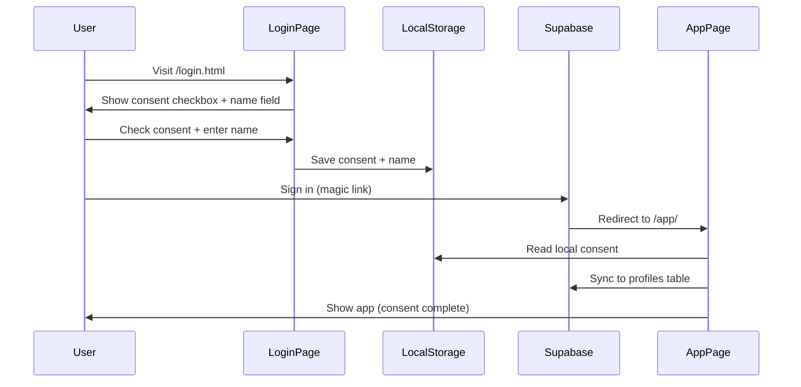
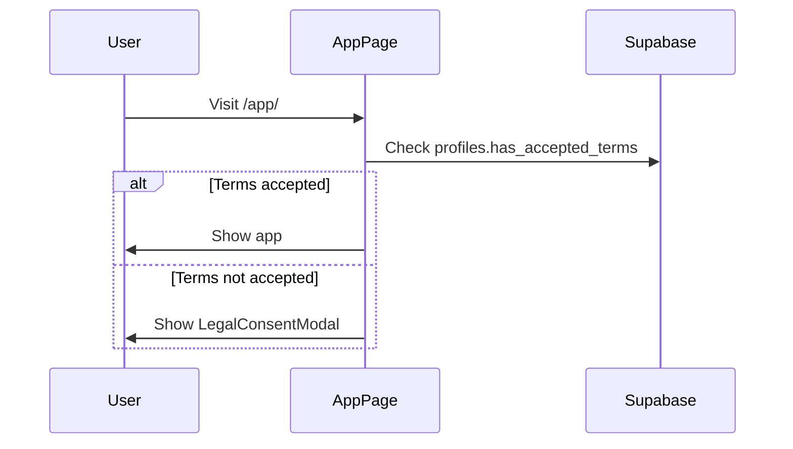

# Legal Consent Layer

## Overview

Veridat implements a comprehensive legal consent system to ensure GDPR compliance and transparency about AI usage. Users must explicitly accept terms and provide their full name before accessing the application.

## Architecture

### Two-Stage Consent Flow

1. **Login Page (Pre-Authentication)**
   - User must check consent box and enter full name on `/login.html`
   - Consent + name are stored locally (device-level) before magic-link sign-in
   - Prevents access to app until consent is completed

2. **App Page (Post-Authentication)**
   - Syncs local consent to database
   - Sync sker helt tyst i bakgrunden (ingen toast/notis)
   - Fallback: Shows modal if no local or DB record exists

### Components

#### `LegalConsentModal.tsx`
Located in `src/components/LegalConsentModal.tsx`

**Props:**
- `mode: 'authenticated' | 'local'` - Determines behavior
- `onAccepted: (fullName: string) => void` - Callback with user's name

**Modes:**
- **`local`**: Used on login page. Saves to `localStorage` only.
- **`authenticated`**: Used in app. Saves to Supabase `profiles` table.

**Features:**
- Full name input (required)
- Disabled "Accept" button until name is entered
- Links to `/privacy.html` and `/terms.html`
- AI disclaimer and GDPR information

## Data Flow

### New User Journey



### Returning User



## Database Schema

### `profiles` Table

```sql
create table profiles (
  id uuid references auth.users not null primary key,
  has_accepted_terms boolean default false,
  terms_accepted_at timestamp with time zone,
  full_name text,
  -- other fields...
);
```

**Key Fields:**
- `has_accepted_terms`: Boolean flag
- `terms_accepted_at`: ISO timestamp for audit trail
- `full_name`: User's full name (required for acceptance)

## Local Storage

**Keys:**
- `has_accepted_terms_local`: `"true"` if accepted on login page
- `user_full_name_local`: User's full name
- `terms_accepted_at_local`: ISO timestamp

## Implementation Details

### Login Page (`src/login.ts`)

```typescript
// User must accept terms + provide full name before sending magic link
if (!consentCheckbox.checked) return;
if (!fullName) return;

localStorage.setItem('has_accepted_terms_local', 'true');
localStorage.setItem('user_full_name_local', fullName);
localStorage.setItem('terms_accepted_at_local', new Date().toISOString());
localStorage.setItem('terms_version_local', CURRENT_TERMS_VERSION);
```

### App Page (`src/main.ts`)

```typescript
if (!hasAccepted) {
    // Check for local consent
    const localConsent = localStorage.getItem('has_accepted_terms_local');
    const localName = localStorage.getItem('user_full_name_local');
    const localTime = localStorage.getItem('terms_accepted_at_local');

    if (localConsent && localName) {
        // Sync to DB
        await supabase.from('profiles').upsert({
            id: session.user.id,
            has_accepted_terms: true,
            terms_accepted_at: localTime,
            full_name: localName
        });
    } else {
        // Show modal in authenticated mode
    }
}
```

## Legal Pages

### Privacy Policy (`privacy.html`)
- GDPR-compliant privacy policy
- Details data collection and AI usage
- User rights (access, deletion, etc.)

### Terms of Service (`terms.html`)
- Terms of use
- AI disclaimer and liability limitations
- User responsibilities

## GDPR Compliance

### Key Aspects

1. **Explicit Consent**: Modal blocks access until user actively clicks "Accept"
2. **Informed Consent**: Full legal text available before acceptance
3. **Audit Trail**: Timestamp and name stored for legal record
4. **User Rights**: Privacy policy details GDPR rights
5. **No Pre-Checked Boxes**: User must actively input name and click accept

### Data Retention

- Consent records stored indefinitely for legal compliance
- Linked to user account via `profiles.id` → `auth.users.id`

## Testing

### Manual Test (Login Flow)

1. Clear `localStorage`: `localStorage.clear()`
2. Navigate to `/login.html`
3. Verify full name + email fields are disabled until consent checkbox is checked
4. Check consent box and enter full name + email
5. Submit and verify magic link is sent, form hides
6. Open the magic link and log in
7. Verify consent syncs to DB and local consent keys are cleared

### Verify Database

```sql
-- Check if consent was saved
SELECT full_name, has_accepted_terms, terms_accepted_at 
FROM profiles 
WHERE id = '<user_id>';
```

## Common Issues

### Modal Not Appearing on Login
- Check browser console for errors
- Verify `LegalConsentModal.tsx` is imported correctly
- Clear cache and localStorage

### Consent Not Syncing to DB
- Check Supabase RLS policies on `profiles` table
- Verify user is authenticated
- Check network tab for 406/403 errors

### Multiple Modals
- Ensure only one modal container exists
- Check for duplicate `mountPreactComponent` calls

## Future Enhancements

- [x] Email confirmation with consent summary
- [x] Version tracking for terms (re-consent on updates)
- [ ] Admin dashboard for consent analytics
- [ ] Multi-language support for legal text

## Recent Updates (December 2025)

### Version Tracking System
- Added `terms_version` field to profiles table
- Created `terms_versions` audit table for version history
- Implemented automatic version checking on user login
- Users are prompted to re-consent when terms are updated
- Version displayed in consent modal footer

### Email Confirmation
- Created Supabase Edge Function `send-consent-email`
- Professional Swedish email template (HTML + plain text)
- Automatic email sent after consent acceptance
- Non-blocking: email failures don't prevent user access
- Tracks `consent_email_sent` status in profiles table

### Email Integration: Resend

**Status:** ✅ **Fully Integrated & Deployed**

The platform uses [Resend](https://resend.com) for sending consent confirmation emails.

#### Configuration

**Resend API Key:**
Stored securely in Supabase secrets:
```bash
supabase secrets set RESEND_API_KEY=re_xxxxx
```

**From Address:**
Currently using Resend's test domain: `Veridat <onboarding@resend.dev>`

**Production Recommendation:**
For production, verify your own domain in Resend:
1. Add domain in Resend dashboard
2. Configure DNS records
3. Update Edge Function: Change `from` address to `noreply@yourdomain.com`
4. Redeploy: `supabase functions deploy send-consent-email`

#### Email Flow

1. User accepts terms in `LegalConsentModal`
2. Profile updated in database (authenticated mode)
3. Edge Function `send-consent-email` invoked
4. Resend API sends professionally formatted email
5. Database updated with `consent_email_sent: true`
6. User receives email confirmation within seconds

**Email Template Features:**
- Branded with Veridat gradient design
- Includes full consent summary (name, email, date, version)
- Links to terms and privacy policy
- GDPR rights information
- Fully responsive HTML + plain text fallback

### Production Deployment: Vercel

**File:** `vercel.json`

The platform is configured for clean, production-ready URLs using Vercel rewrites.

#### URL Structure

**Development:**
- `http://localhost:5173/login.html` ✅
- `http://localhost:5173/app/index.html` ✅

**Production:**
- `https://yourdomain.com/login` 🎯
- `https://yourdomain.com/app` 🎯
- `https://yourdomain.com/privacy` 🎯
- `https://yourdomain.com/terms` 🎯

#### Vercel Configuration

```json
{
  "rewrites": [
    { "source": "/login", "destination": "/login.html" },
    { "source": "/app", "destination": "/app/index.html" },
    { "source": "/privacy", "destination": "/privacy.html" },
    { "source": "/terms", "destination": "/terms.html" }
  ],
  // ... headers
}
```

#### Vite Configuration (Local Development)

To ensure clean URLs work locally (matching production), a custom middleware was added to `vite.config.ts`:

```typescript
plugins: [
    preact(),
    {
        name: 'html-rewrite',
        configureServer(server) {
            server.middlewares.use((req, res, next) => {
                if (req.url === '/login') req.url = '/login.html';
                else if (req.url === '/app') req.url = '/app/index.html';
                else if (req.url === '/privacy') req.url = '/privacy.html';
                else if (req.url === '/terms') req.url = '/terms.html';
                next();
            });
        },
    },
],
```

**Security Headers:**
- `X-Content-Type-Options: nosniff` - Prevents MIME sniffing
- `X-Frame-Options: DENY` - Prevents clickjacking
- `X-XSS-Protection: 1; mode=block` - Enables XSS filtering

#### Code Updates for Clean URLs

All internal redirects updated to use clean paths:
- `window.location.href = '/login'` (not `/login.html`)
- `window.location.href = '/app'` (not `/app/`)
- Email redirect: `emailRedirectTo: origin + '/app'`

**Files Modified:**
- `src/components/LegalConsentModal.tsx`
- `src/main.ts`
- `src/login.ts`
- `src/landing/App.tsx`
- `src/landing/components/Hero.tsx`

### Technical Details
- Version constant: `src/constants/termsVersion.ts`
- Email templates: `src/utils/emailTemplates.ts`
- Edge Function: `supabase/functions/send-consent-email/`
- Migration: `20251201000001_add_terms_versioning.sql`
- Deployment config: `vercel.json`

### Deployment Checklist

**Database:**
- [x] Migration applied to Supabase Cloud
- [x] `terms_versions` table created with initial version 1.0.0
- [x] `profiles` table extended with version tracking fields

**Email Service:**
- [x] Resend account created
- [x] API key stored in Supabase secrets
- [x] Edge Function deployed with Resend integration
- [x] Email template tested and working
- [ ] Custom domain verified (optional, using test domain for now)

**Hosting:**
- [x] Vercel configuration created
- [x] Clean URLs configured with rewrites
- [x] Security headers added
- [x] Code updated to use clean paths

### Monitoring & Maintenance

**Check Email Sending:**
```bash
# View Edge Function logs
https://supabase.com/dashboard/project/[project-id]/functions
```

**Query Email Status:**
```sql
-- Users who haven't received confirmation email
SELECT id, full_name, has_accepted_terms, consent_email_sent
FROM profiles
WHERE has_accepted_terms = true 
  AND (consent_email_sent = false OR consent_email_sent IS NULL);

-- Email delivery rate
SELECT 
  COUNT(*) as total_consents,
  SUM(CASE WHEN consent_email_sent THEN 1 ELSE 0 END) as emails_sent,
  ROUND(100.0 * SUM(CASE WHEN consent_email_sent THEN 1 ELSE 0 END) / COUNT(*), 2) as delivery_rate
FROM profiles
WHERE has_accepted_terms = true;
```

**Version Tracking:**
```sql
-- Users on outdated terms version
SELECT id, full_name, terms_version, terms_accepted_at
FROM profiles
WHERE terms_version != '1.0.0' OR terms_version IS NULL
ORDER BY terms_accepted_at DESC;
```

### Updating Terms in Production

When you need to update terms or privacy policy:

1. **Update the legal documents:**
   - Edit `/terms.html` or `/privacy.html`
   - Review changes thoroughly

2. **Increment version:**
   - Open `src/constants/termsVersion.ts`
   - Change `CURRENT_TERMS_VERSION` to next version (e.g., `"1.1.0"`)
   - Add entry to `VERSION_HISTORY` with change summary

3. **Deploy:**
   - Commit and push to Vercel
   - All users will be prompted to re-consent on next login

4. **Monitor:**
   - Watch Edge Function logs for email delivery
   - Query database for re-consent completion rates
   - Ensure users can still access the platform

**Important:** All existing users will need to re-consent. Plan accordingly and communicate changes if significant.
